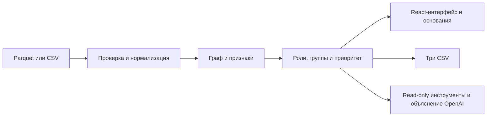

# MoneyGraph AI

Рабочее место AML-аналитика для кейса Freedom «Граф денег». Известен **81 исходный клиент**, но в цепочках переводов уже **2 248 счетов**. Вручную трудно понять, кто собирает деньги, кто передаёт их дальше и с кого начать проверку.

MoneyGraph превращает эту сеть в **очередь из 50 ранее неизвестных счетов**: у каждого есть предполагаемая роль, численное основание и связи с исходными клиентами. Аналитик выбирает счёт, сверяет объяснение с переводами и выгружает результаты. Это поддержка ручного расследования, а не автоматическое обвинение или блокировка счёта.

Реализованы направленный граф, шесть ролей, группы связей, поиск по GID и три CSV по контракту кейса. Интерфейс — React/Cytoscape; сервер и расчёты — FastAPI, Pandas, NetworkX и scikit-learn. Основной сценарий работает без ключа OpenAI.

## Проверить ценность за 60 секунд

После запуска с официальными данными:

1. **0–10 с:** нажмите «Обзор за 60 секунд» и убедитесь, что выбран набор «Данные хакатона»: 2 248 счетов и 4 840 операций. Учебный набор 42 / 172 — другой сценарий.
2. **10–25 с:** откройте первый счёт из очереди. Граф «Связи счёта» показывает до четырёх крупнейших контрагентов с каждой стороны; роль и приоритет находятся рядом.
3. **25–45 с:** нажмите «Проверить основания»: сопоставьте численные признаки с конкретными переводами. Даты не содержат времени суток; вывод о транзите за час здесь недоступен.
4. **45–60 с:** нажмите «Скачать 3 CSV». Результат — все 2 248 ролей, сводки групп и top-50 для дальнейшей проверки.

Подготовка, пятиминутная защита и резервный сценарий: [docs/DEMO.md](docs/DEMO.md).

Для подробного просмотра увеличьте число контрагентов до 8 или 12 либо переключитесь на «Вся сеть». Ограничение отображения не удаляет узлы из расчёта и CSV. Во вкладке «AI-проверка» запускается агент, а «Вопрос» открывает обычную справку и чат. Карточки показателей и журнал действий адаптированы из двух компонентов 21st.dev — `StatsCard` и `AgentActivity`; ссылки на оригиналы и оговорки об условиях использования — в [источниках интерфейса](docs/UI_SOURCES.md).

## Запуск

Нужны Python 3.14, Node.js 22.12+ или 24 и pnpm. Команды выполняются из корня репозитория.

```sh
python run.py --port 8002
```

Запускатор создаёт `.venv`, устанавливает недостающие Python-зависимости из `requirements-lock.txt` и собирает frontend, если `frontend/dist` ещё нет. Первая установка требует интернета. Откроется [приложение](http://127.0.0.1:8002); [API-документация](http://127.0.0.1:8002/docs) доступна на том же порту. Остановка — Ctrl+C. Порт по умолчанию — 8000.

Для явной установки:

```sh
python -m venv .venv
```

Активируйте окружение: Windows PowerShell — `.\.venv\Scripts\Activate.ps1`; macOS/Linux — `source .venv/bin/activate`. Затем:

```sh
python -m pip install -r requirements-lock.txt
cd frontend
pnpm install --frozen-lockfile
pnpm build
cd ..
python run.py --port 8002
```

После изменения интерфейса повторите `pnpm build`: существующий `dist` запускатор не пересобирает автоматически. Основное приложение — этот React/FastAPI-проект.

## Данные

Учебный набор включён в репозиторий: **42 вымышленных счёта, 172 перевода** с точным временем. Для официального кейса положите локально:

```text
data/official/
  nodes.parquet
  edges.parquet
  transactions.parquet
```

Если эти файлы есть, сервер по умолчанию выбирает официальный набор; иначе — учебный. Другой каталог можно задать через `MONEYGRAPH_DATA_DIR`. Официальные данные не включены в Git. Все GID в расчётах, API и интерфейсе сохраняются строками без округления.

Копировать файлы в репозиторий необязательно. Укажите **папку с тремя Parquet**, заменив пример пути своим:

```sh
# macOS / Linux
MONEYGRAPH_DATA_DIR="/absolute/path/data" python run.py --port 8002
```

```powershell
# Windows PowerShell
$env:MONEYGRAPH_DATA_DIR = "C:\path\data"
python run.py --port 8002
```

Переменная задаёт данные веб-сервера. Для командного расчёта передайте эту же папку явно: `python pipeline.py --data "/absolute/path/data" --out out`. После смены переменной перезапустите сервер. Если выбран учебный набор, нельзя представлять его результаты как анализ кейса.

Интерфейс принимает CSV, отдельный Parquet с транзакциями или ZIP с тремя официальными таблицами. Стандартный CSV:

```csv
sender,receiver,amount,timestamp
0001,0002,5000,2026-07-01T10:00:00Z
```

Поддерживается и схема `src,dst,sum_kzt,date`. Полный ZIP сохраняет seed, глубину и изолированные узлы; отдельные транзакции не содержат этих сведений. Пределы: 50 МБ, 20 000 операций, 5 000 узлов, до 8 загруженных наборов. Загрузки хранятся в памяти и исчезают при перезапуске.

Проверенный официальный набор: **2 248 узлов, 3 119 направленных пар, 4 840 операций**, 81 seed, 19 изолятов, 444 узла четвёртого перехода. В полном графе 35 слабосвязных компонент, включая 19 изолятов. Период — июль 2026, валюта — KZT.

## Выгрузки одной командой

В активированном окружении:

```sh
python pipeline.py --data data/official --out out
```

Команда читает данные заново, проверяет согласованность таблиц и создаёт:

| Файл | Содержимое |
|---|---|
| `nodes_roles.csv` | Все счета, роль, сила правила, группа, приоритет, численное основание до 200 символов |
| `clusters.csv` | Размер группы, число seed, внутренний оборот, ведущие GID и гипотеза |
| `top_nodes.csv` | До 50 ранее неизвестных счетов по убыванию приоритета, с объяснениями |

На официальном наборе получены **2 248 ролей, 66 групп, 50 кандидатов**. Два текущих локальных прогона заняли **0,72 / 0,71 с**, три CSV совпали побайтно. Время зависит от среды. Группы Louvain и слабосвязные компоненты — разные характеристики графа.

Приоритет в интерфейсе имеет шкалу **0–100**, в CSV — **0–1**: это тот же балл, делённый на 100. Длинные GID записываются полностью. Маленький пользовательский набор может дать меньше 20 кандидатов. ZIP с тремя CSV доступен через интерфейс и `GET /api/export`. Основной расчёт работает без OpenAI.

## Роли и приоритет

Правила находятся в [backend/roles_engine.py](backend/roles_engine.py). После проверки ограничений выгрузки роли проверяются в следующем порядке.

| Роль | Правило |
|---|---|
| `coordinator` | Минимум два входа и два выхода, достижимость минимум из двух seed за четыре перехода, посредничество не ниже 92-го процентиля положительных значений |
| `consolidator` | Не seed; минимум три плательщика, входящий объём не ниже медианы положительных входов, разница входа и выхода — минимум 35% входа внутри выгрузки |
| `distributor` | Минимум пять получателей; seed либо число плательщиков не больше `max(2, число получателей // 2)` |
| `transit` | Не seed; есть вход и выход, отношение исходящего объёма к входящему от 0,65 до 1,5 |
| `terminal` | Есть вход, нет внешнего выхода, известная глубина меньше четырёх; предыдущие правила не сработали |
| `peripheral` | Недостаточно признаков или действует ограничение наблюдения |

Узлы четвёртого перехода без выхода, seed без выхода и получатели с неизвестной глубиной не объявляются конечными получателями. `role_score` — сила эвристики, не калиброванная вероятность. Дополнительные паттерны переводов рассчитываются отдельно; их может быть несколько у одного счёта.

Базовые веса приоритета: граф — 35%, Isolation Forest — 25%, паттерны — 25%, внутридневной поток — 15%. Недоступный компонент исключается, остальные веса нормируются. Для дневных данных это примерно **41,18% / 29,41% / 29,41%** без внутридневного потока. Коэффициент seed — **0,7**, обрезанного листа четвёртого перехода — **0,65**. Фактические веса и коэффициент показаны в «Основаниях».

Графовая часть использует направленное посредничество, PageRank по объёмам, степень и, при наличии seed, достижимость от них. Louvain работает на неориентированной проекции с суммой `log1p` весов встречных рёбер. Isolation Forest ищет необычные сочетания признаков; начальное значение генератора — 42. Баллы относительны к текущему набору.

## Даты и основания

В официальном наборе **нет времени суток**. Минутный FIFO, доля переводов за час и зависимые сигналы отключены. Дневной показатель отражает наличие исходящей операции в ту же или следующие две даты; он не связывает суммы. Порядок операций внутри одной даты неизвестен.

«Основания» показывает серверные показатели, правила, исходные операции и выборку путей. Для точных временных отметок доступно расчётное FIFO-сопоставление; оно также не доказывает движение одних и тех же денег.

## ИИ-помощник и ограниченный агент

Числа, роли и рейтинг рассчитываются локально. Обычная AI-справка объясняет уже выбранные факты. Отдельный сценарий `POST /api/ai/investigate` позволяет модели последовательно выбирать инструменты чтения аналитики, получать результаты и решать, нужна ли следующая проверка: `get_account` — показатели счёта, `get_connections` — до восьми крупнейших прямых связей, `get_transactions` — до десяти крупнейших операций.

Цикл ограничен **пятью вызовами инструментов, пятью обращениями к модели и бюджетом 45 секунд с сетевыми таймаутами**. Это бюджет выполнения, не строгая гарантия полного времени ответа. Последний ход модели зарезервирован под итог (`tool_choice=none`); повтор уже успешно выполненного запроса к данным отклоняется. В интерфейсе показывается журнал фактических вызовов и их результатов, а не скрытые рассуждения модели. Агент не меняет исходные данные, оценки или счета и не выполняет банковских действий.

`mode=agent, status=completed` означает завершённый модельный цикл с инструментами. При `status=limited` показаны только выполненные проверки, без подтверждённой итоговой рекомендации. `mode=rules, status=unavailable` сообщает об отсутствии ключа или ошибке; это не имитация ответа модели. Обычная справка по правилам доступна независимо от агента. Подтверждение настройки ключа само по себе не подтверждает успешный запрос провайдеру.

Живые вызовы нового агента проверялись **только на синтетическом учебном наборе**. После последней корректировки браузерный запуск для `F` завершился как `agent/completed`: три реальных вызова, три факта и следующий кандидат `X`; журнал и факты видны в интерфейсе. Время финального запуска не измерялось. Ранее зафиксированы успешный запрос за 14,75 с и честный `limited` до корректировки; полная история — в [VERIFICATION.md](VERIFICATION.md). Успешный запрос не гарантирует завершение каждого следующего исследования. Официальная выгрузка в live-проверках не использовалась.

Создайте локальный `.env` по примеру `.env.example`, задайте `OPENAI_API_KEY` и перезапустите сервер. Модель задаётся через `OPENAI_MODEL`. Ключ остаётся на сервере и не включается в Git.

При использовании OpenAI ограниченный контекст выбранных счетов, операций и путей передаётся внешнему API. Используйте только разрешённые для такой передачи данные. Для показа работы модели можно выбрать учебный набор. Граф, роли, поиск, группы и CSV остаются доступны без внешнего API; после установки зависимостей для основного расчёта интернет не нужен. Подробнее: [простое объяснение ИИ](AI-EXPLAINED-RU.md).

## Что жюри может проверить

Ниже — максимальные веса из предоставленного скриншота общей рубрики, **не самооценка и не обещанные баллы**.

| Критерий | Вес рубрики | Проверяемое свидетельство |
|---|---:|---|
| Проблема и ценность | 15 | Задача AML-аналитика: 81 исходный клиент → 2 248 счетов → очередь проверки; первый раздел README и минутный сценарий |
| Функциональность прототипа | 25 | Живой расчёт трёх Parquet, поиск произвольного GID, роль с основанием, граф и три заполненных CSV |
| Техническая реализация | 15 | Единый результат расчёта используется API, React-интерфейсом и экспортом; тесты схем, идентификаторов, ролей и ограничений дат |
| Практическая применимость | 15 | Аналитик выбирает следующий счёт и проверяет гипотезу по исходным операциям; решение о дальнейших действиях остаётся человеку |
| Потенциал развития | 20 | Конкретные следующие этапы ниже: журнал решений, регулярная загрузка и выдача подграфов; они не выданы за готовые функции |
| README и воспроизводимость | 10 | Команды запуска, контракт данных, работа без API, экспорт, ограничения и [сценарий защиты](docs/DEMO.md) |

В DOCX финансового кейса указана другая схема весов. Не складываем две шкалы и не вводим новую: **какую рубрику применяют к финальной оценке, нужно уточнить у организаторов**. Контракт результатов финансового кейса соблюдается независимо от ответа.

## Проверка и разработка

```sh
python -m pytest tests -q
node --test frontend/src/components/graph-layout.test.js
```

Проверки текущего обновления:

- **115 pytest passed / 3 skipped** за **2,56 с**, включая **18 тестов агента**. Три пропуска — проверки файлов в репозиторном `data/official`, где исходные Parquet отсутствуют; официальный набор отдельно проверен из внешней папки.
- **8 Node-тестов графа прошли**, production-сборка frontend завершилась успешно.
- Два CLI-прогона настоящего набора: **2 248 узлов / 3 119 пар / 4 840 операций**, **66 кластеров**, **50 non-seed кандидатов**; **0,72 / 0,71 с**, все три CSV побайтно одинаковы.
- Финальный браузерный live-прогон после корректировки цикла: **synthetic F → `agent/completed` → 3 вызова → 3 факта → следующий кандидат X**. Вызов OpenAI на официальной выгрузке не выполнялся; предыдущий `limited` сохранён в истории проверки.
- В браузере проверены переход к кандидату `X`, поиск полного официального GID и основания; экспорт подтверждён сохранённым ZIP с тремя CSV на 2 248 / 66 / 50 строк.

Историческая проверка до этого обновления: 100 passed в среде с официальными fixture-файлами; независимый аудит базового `b83c506` — 97 passed / 3 skipped без них. Эти результаты не подменяют текущие. Подробная область проверок фиксируется в [VERIFICATION.md](VERIFICATION.md).

Для разработки интерфейса запустите backend на 8000 и `pnpm dev` из `frontend`: Vite проксирует `/api` на 8000. Production-сборку сервер отдаёт из `frontend/dist`.



## Следующие этапы — пока не реализованы

1. **Рабочее место аналитика:** сохранить статус проверки, заметки и ссылки на доказательства; добавить роли доступа и журнал действий. Проверять не «точность выявления преступления», а полноту оснований и время разбора контрольных кейсов.
2. **Регулярные выгрузки:** версионировать наборы, проверять схему и суммы при каждом импорте, сравнивать изменения связей между периодами. Обратную связь аналитика сохранять отдельно от исходных данных.
3. **Большие графы:** хранить операции отдельно от агрегированных связей, считать тяжёлые признаки фоновыми задачами, кэшировать результаты и отдавать только выбранный подграф с пагинацией. Сначала измерить время расчёта, память и задержку интерфейса на 10 тыс. и 100 тыс. узлов; поддержку миллиона не заявлять до нагрузочного теста.

Сейчас это локальный MVP с пределом 5 000 узлов, без авторизации, истории решений, долговременного хранилища загрузок и банковских интеграций. Нет эталонной разметки ролей: качество эвристик на практике ещё предстоит оценить. Роль и балл не устанавливают нарушение.

[Сравнение вариантов](docs/MVP_COMPARISON.md) · [Требования кейса](docs/CASE_REQUIREMENTS.md) · [Работа команды](TEAM.md)
