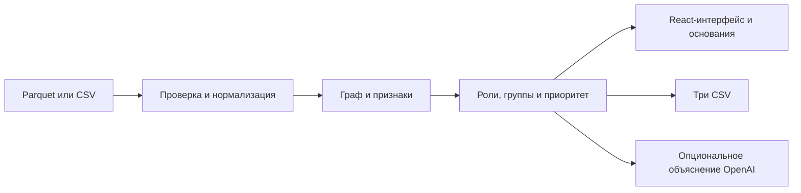

# MoneyGraph AI

Единое рабочее место для анализа переводов: граф, шесть объяснимых ролей счетов, очередь проверки, группы связей и три CSV для кейса. Интерфейс — React/Cytoscape; сервер и расчёты — FastAPI, Pandas, NetworkX и scikit-learn.

Приоритет определяет порядок ручной проверки. Роль и балл не устанавливают нарушение.

## Запуск

Нужны Python 3.14, Node.js 22.12+ или 24 и pnpm. Команды выполняются из корня репозитория.

```sh
python run.py --port 8002
```

Запускатор создаёт `.venv`, устанавливает недостающие Python-зависимости из `requirements-lock.txt` и собирает frontend, если `frontend/dist` ещё нет. Первая установка требует интернета. Откроется [приложение](http://127.0.0.1:8002); [API-документация](http://127.0.0.1:8002/docs) доступна на том же порту. Остановка — Ctrl+C. Порт по умолчанию — 8000.

Для явной установки:

```sh
python -m venv .venv
```

Активируйте окружение: Windows PowerShell — `.\.venv\Scripts\Activate.ps1`; macOS/Linux — `source .venv/bin/activate`. Затем:

```sh
python -m pip install -r requirements-lock.txt
cd frontend
pnpm install --frozen-lockfile
pnpm build
cd ..
python run.py --port 8002
```

После изменения интерфейса повторите `pnpm build`: существующий `dist` запускатор не пересобирает автоматически. Основное приложение — этот React/FastAPI-проект.

## Данные

Учебный набор включён в репозиторий: **42 вымышленных счёта, 172 перевода** с точным временем. Для официального кейса положите локально:

```text
data/official/
  nodes.parquet
  edges.parquet
  transactions.parquet
```

Если эти файлы есть, сервер по умолчанию выбирает официальный набор; иначе — учебный. Другой каталог можно задать через `MONEYGRAPH_DATA_DIR`. Официальные данные не включены в Git. Все GID в расчётах, API и интерфейсе сохраняются строками без округления.

Интерфейс принимает CSV, отдельный Parquet с транзакциями или ZIP с тремя официальными таблицами. Стандартный CSV:

```csv
sender,receiver,amount,timestamp
0001,0002,5000,2026-07-01T10:00:00Z
```

Поддерживается и схема `src,dst,sum_kzt,date`. Полный ZIP сохраняет seed, глубину и изолированные узлы; отдельные транзакции не содержат этих сведений. Пределы: 50 МБ, 20 000 операций, 5 000 узлов, до 8 загруженных наборов. Загрузки хранятся в памяти и исчезают при перезапуске.

Проверенный официальный набор: **2 248 узлов, 3 119 направленных пар, 4 840 операций**, 81 seed, 19 изолятов, 444 узла четвёртого перехода. В полном графе 35 слабосвязных компонент, включая 19 изолятов. Период — июль 2026, валюта — KZT.

## Выгрузки одной командой

В активированном окружении:

```sh
python pipeline.py --data data/official --out out
```

Команда читает данные заново, проверяет согласованность таблиц и создаёт:

| Файл | Содержимое |
|---|---|
| `nodes_roles.csv` | Все счета, роль, сила правила, группа, приоритет, численное основание до 200 символов |
| `clusters.csv` | Размер группы, число seed, внутренний оборот, ведущие GID и гипотеза |
| `top_nodes.csv` | До 50 ранее неизвестных счетов по убыванию приоритета, с объяснениями |

На официальном наборе получены **2 248 ролей, 66 групп, 50 кандидатов** за **2,34–2,45 с** в проверенной локальной среде. Группы Louvain и слабосвязные компоненты — разные характеристики графа.

Приоритет в интерфейсе имеет шкалу **0–100**, в CSV — **0–1**: это тот же балл, делённый на 100. Длинные GID записываются полностью. Маленький пользовательский набор может дать меньше 20 кандидатов. ZIP с тремя CSV доступен через интерфейс и `GET /api/export`. Основной расчёт работает без OpenAI.

## Роли и приоритет

Правила находятся в [backend/roles_engine.py](backend/roles_engine.py). После проверки ограничений выгрузки роли проверяются в следующем порядке.

| Роль | Правило |
|---|---|
| `coordinator` | Минимум два входа и два выхода, достижимость минимум из двух seed за четыре перехода, посредничество не ниже 92-го процентиля положительных значений |
| `consolidator` | Не seed; минимум три плательщика, входящий объём не ниже медианы положительных входов, разница входа и выхода — минимум 35% входа внутри выгрузки |
| `distributor` | Минимум пять получателей; seed либо число плательщиков не больше `max(2, число получателей // 2)` |
| `transit` | Не seed; есть вход и выход, отношение исходящего объёма к входящему от 0,65 до 1,5 |
| `terminal` | Есть вход, нет внешнего выхода, известная глубина меньше четырёх; предыдущие правила не сработали |
| `peripheral` | Недостаточно признаков или действует ограничение наблюдения |

Узлы четвёртого перехода без выхода, seed без выхода и получатели с неизвестной глубиной не объявляются конечными получателями. `role_score` — сила эвристики, не калиброванная вероятность. Дополнительные паттерны переводов рассчитываются отдельно; их может быть несколько у одного счёта.

Базовые веса приоритета: граф — 35%, Isolation Forest — 25%, паттерны — 25%, внутридневной поток — 15%. Недоступный компонент исключается, остальные веса нормируются. Для дневных данных это примерно **41,18% / 29,41% / 29,41%** без внутридневного потока. Коэффициент seed — **0,7**, обрезанного листа четвёртого перехода — **0,65**. Фактические веса и коэффициент показаны в «Основаниях».

Графовая часть использует направленное посредничество, PageRank по объёмам, степень и, при наличии seed, достижимость от них. Louvain работает на неориентированной проекции с суммой `log1p` весов встречных рёбер. Isolation Forest ищет необычные сочетания признаков; начальное значение генератора — 42. Баллы относительны к текущему набору.

## Даты и основания

В официальном наборе **нет времени суток**. Минутный FIFO, доля переводов за час и зависимые сигналы отключены. Дневной показатель отражает наличие исходящей операции в ту же или следующие две даты; он не связывает суммы. Порядок операций внутри одной даты неизвестен.

«Основания» показывает серверные показатели, правила, исходные операции и выборку путей. Для точных временных отметок доступно расчётное FIFO-сопоставление; оно также не доказывает движение одних и тех же денег.

## OpenAI

Создайте локальный `.env` по примеру `.env.example`, задайте `OPENAI_API_KEY` и перезапустите сервер. Модель задаётся через `OPENAI_MODEL`. Ключ остаётся на сервере и не включается в Git.

OpenAI получает ограниченный контекст выбранных счетов, операций и путей. При использовании функции этот контекст передаётся внешнему API. Без ключа или при ошибке показывается «Сводка по правилам». Подробнее: [простое объяснение ИИ](AI-EXPLAINED-RU.md).

## Проверка и разработка

```sh
python -m pytest tests -q
```

Полный прогон: **100 passed**, одно `StarletteDeprecationWarning`, **11,67 с**. Production-сборка Vite 7.3.6 прошла за **6,87 с**. Проверка браузерного сценария фиксируется в [VERIFICATION.md](VERIFICATION.md).

Для разработки интерфейса запустите backend на 8000 и `pnpm dev` из `frontend`: Vite проксирует `/api` на 8000. Production-сборку сервер отдаёт из `frontend/dist`.



Это локальный MVP без авторизации, истории решений и постоянного хранилища загрузок. Миллион узлов не проверялся: такой масштаб потребует отдельного хранения графа, пакетных и приближённых расчётов и выдачи подграфов по запросу.

[Сравнение вариантов](docs/MVP_COMPARISON.md) · [Требования кейса](docs/CASE_REQUIREMENTS.md) · [Работа команды](TEAM.md)
